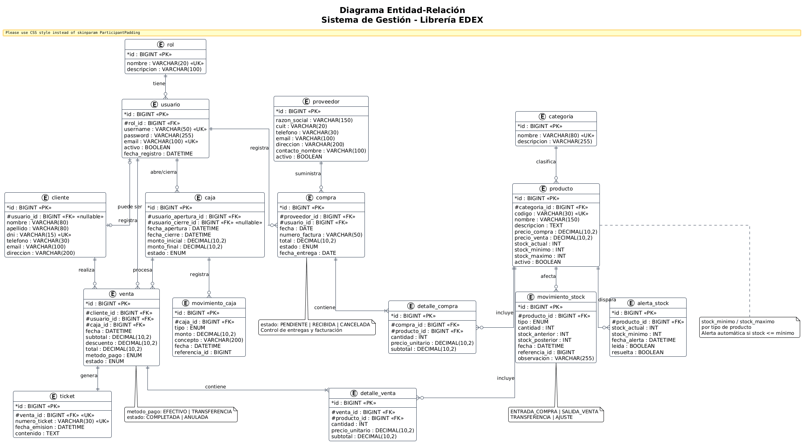
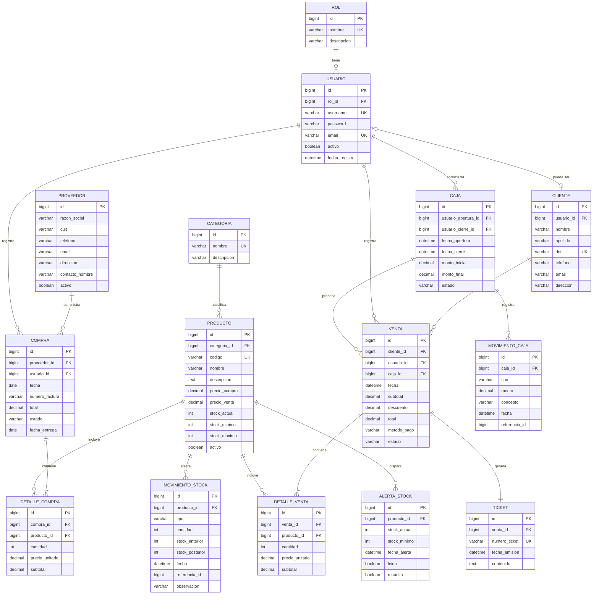
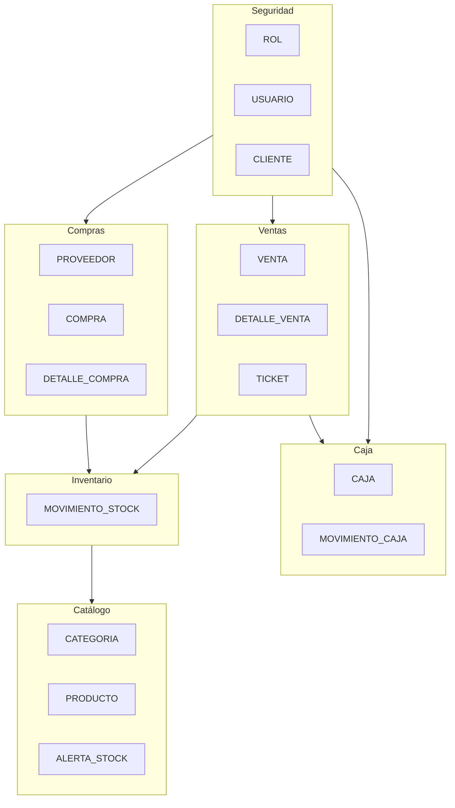

# Diagrama Entidad-Relación — Librería EDEX

Sistema de gestión para venta de útiles escolares (Spring Boot + Vaadin + MySQL).

## Diagrama ER

## Diagrama de módulos

## Cómo visualizar

| Formato | Archivo | Herramienta |
|---------|---------|-------------|
| PlantUML | `libreria-edex-er.puml` | [PlantUML Online](https://www.plantuml.com/plantuml/uml/), VS Code + extensión PlantUML |
| Mermaid | Este archivo `.md` | Preview de Markdown en Cursor/VS Code, GitHub |
| Imagen PNG | `libreria-edex-er.png` | Generada con PlantUML |
